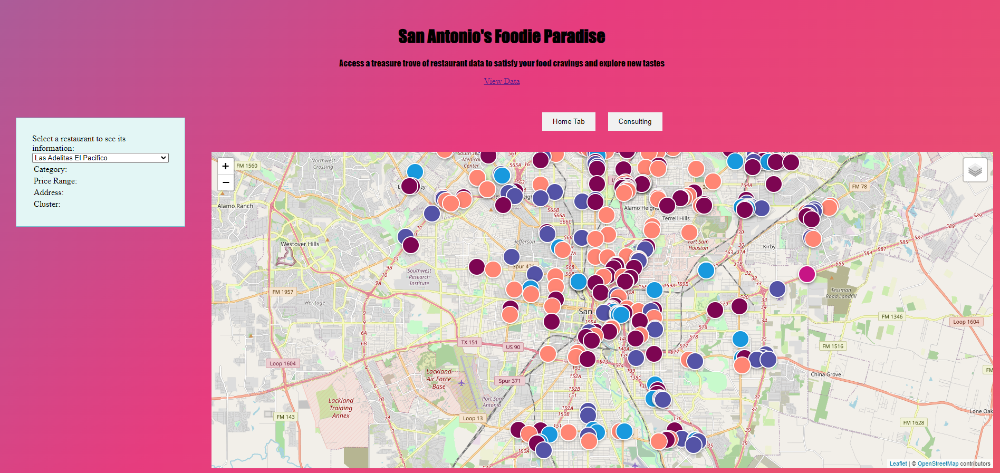
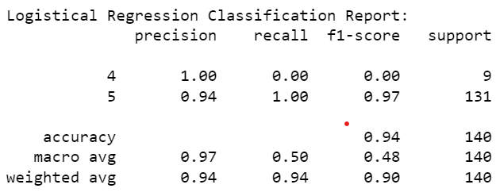
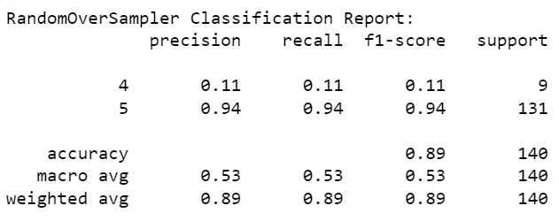

# Restaurant Scores in San Antonio

## Table of Contents
- [Introduction](#introduction)
- [Features](#features)
- [Getting Started](#getting-started)
- [Usage](#usage)
- [Processes and Technologies](#processes-and-technologies)
- [Challenges](#challenges)
## Introduction
The San Antonio Restaurants Dashboard is a web-based application that allows users to explore and visualize data about restaurants in San Antonio. It provides various visualizations, such as a map view, charts, and a restaurant list. Users can interact with the dashboard to view restaurant details, scores, and price-range. By using the layer feature of the map, users can diplay restaurants by cluster of scores, thereby making it easy to find the highest scored restaurants in their own neighborhood! Additionally, we have added different tabs to the site that allow us to answer the following questions about the data: What zip code should you stay in San Antonio to be close to delectable food?, Are all the good Mexican food places actually inside 410?, What are the highest scored food categories in Cluster 0: Top Shelf (4.7-5.0)?.
## Features
- Interactive map showing restaurant locations
- Filter layers on the map to show restaurants grouped by score
- Restaurant list with sorting and filtering options

## Getting Started
To get started with the San Antonio Restaurants Dashboard, follow these steps:
1. Clone the repository: `git clone `
2. Navigate to the project directory: `cd `
3. Install the libraries: psycopg2, chart.js
4. Run the included code to set up your database and import the csv in pgadmin4s
5. Change the information in the `config.py` file to your username, password and port for pgadmin4

## Usage
1. Start the application:
2. Open your web browser and go to `http://localhost:5000` to access the dashboard.
3. Explore the various visualizations and interact with the features.
   

## Processes and Technologies

**HTML, JS, css, postgresSQL and Python API Flask App**
The first part of this project neccessitated the following libraries and techniques: flask, psycopg2, d3.json. We created a database using postgresSQL to hold the restaurant data and pulled this database through a Python API Flask App in order to visualize the data on a Leaflet map. In coordination with our HTML, JavaScript and css files, we created the dashboard as detailed above. With this dashboard in place, we moved on to the second part of the project.

**Machine Learning**
To begin this part of the project, we imported the libraries and techniques: `sklearn.metrics`, `sklearn.cluster`, `kMeans`, `StandardScaler`, `pandas`, `matplotlib`, `imblearn.over_sampling`, `RandomOverSampler`, `Seaborn` and `numpy`. We first cleaned up the data in Jupyter Notebook; dropping NaN values and unecessary columns so that we had a clean dataset at 558 rows and six columns. With this cleaned dataset, we were able to use `get_dummies` to convert categorical columns to numerical values and conduct a logistical regression. An assessment of the model gave us a Balanced Accuracy Score: 0.5, Confusion Matrix: [[  0   9] [  0 131]] and a Classification Report as seen below:

In order to further calibrate and test our model, we decided to create a logistic regression model with resampled training data. Using `RandomOverSampler`, we were able to achieve a Balanced Accuracy Score: 0.5250212044105174, Confusion Matrix: [[  1   8] [  8 123]] and a Classification Report:

Since there wasn't any significant improvement to the balanced accuracy score or the classification report, we recommend using the original 
Logistic Regression model for further analyis. To continue, we used kMeans to cluster the data. In looking at the clustering we noticed two significant insights. First, that the model clustered the restaurants based on the score (i.e. 4-7-5.0 scores in the same cluster) and second, that the model also took into account the price of the restaurant as well (i.e. $ mostly in one cluster, $$ mostly in another cluster etc.)

With this in mind, we were able to use these clusters to answer some questions about the cuisine available in San Antonio.
## Challenges
Initially, when we started the machine learning step of the project, we started with linear regression. After receiving a negative r value, we realized that we had discrete values instead of continuous and needed to pivot to logistic regression instead. the other major challenge we faced was incorporating each of our visual elements into the tabs on the live web server. After troubleshooting as a team and revising the file path (many times!) we were able to successfully include all of our visuals.

As always, teamwork, communication and collaboration have helped us face and conquer each of these challenges (and more!).
--The Cool Cat Coders: Asfia, Matty, Saroja, Taniya, Veronica